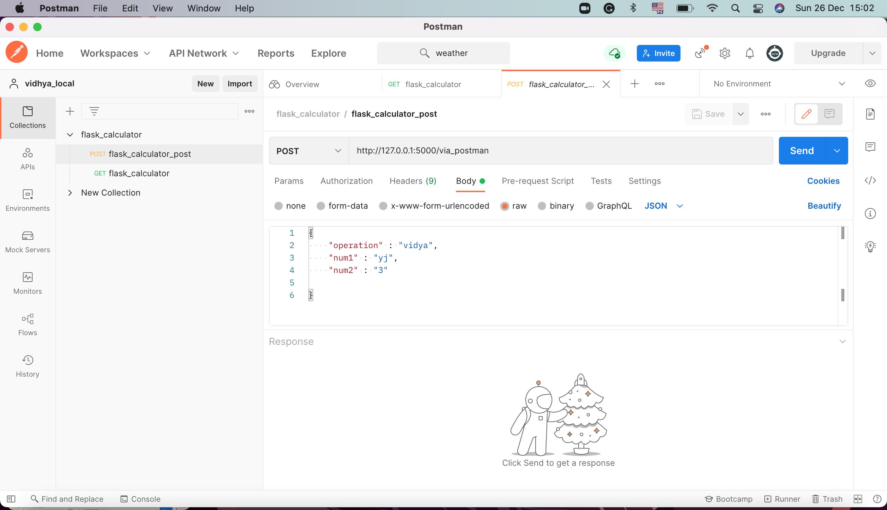
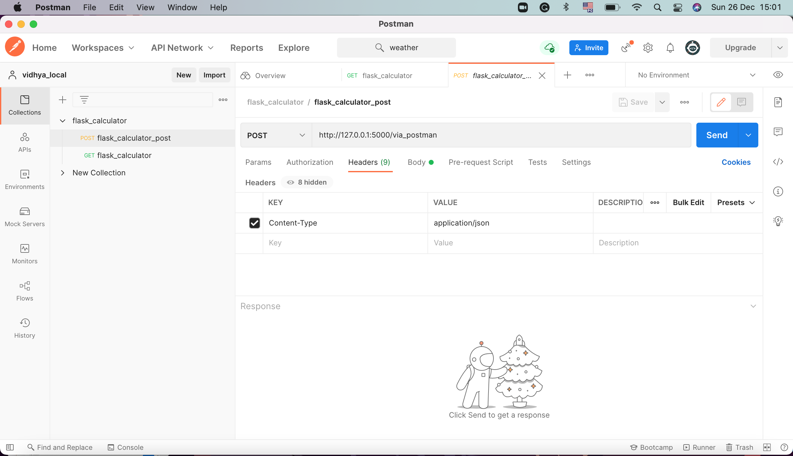

# A Basic Calculator using Flask

#### Flask is a lightweight WSGI web application framework. It is designed to make getting started quick and easy, with the ability to scale up to complex applications.

#### Get vs Post
These are methods of requesting data.
when you search for anything on Google, you can easily see your search query in the resulting URL but When you log in to your Gmail account, the resulting URL doesn't show your Gmail id or password.
#### Google search use Get Method-For less secure data 
#### Gmail log in use Post Method-for secured data

This is a simple calculator API. Here the route will take json input, which will be passed using Postman.

#### Postman is a collaboration platform for API development. Postman's features simplify each step of building an API and streamline collaboration so, a better and faster APIs are created.

### Step-1:
Create a virtual envirnoment : python3 -m venv env

Activate virtual envirnoment : source env/bin/activate

Install Flask : pip install Flask

### Step-2: app.py
Import flask

create flask object

create app routes following with function associated with that route (Postman)

run app()

### Step-3:
Add header and body to the local workspace in Postman.
And also add Flask URL with route at the POST method.

